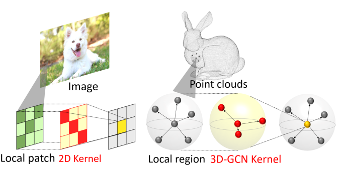
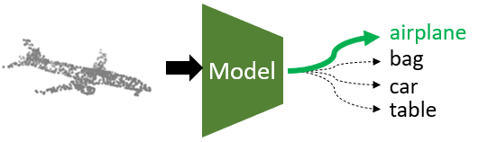
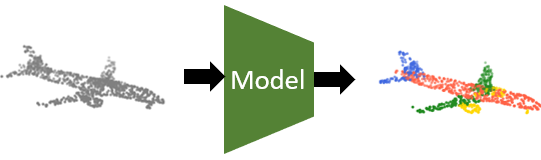

## The paper we choose:

### Convolution in the Cloud: Learning Deformable Kernels in 3D Graph Convolution Networks for Point Cloud Analysis

created by Zhi-Hao Lin, Sheng-Yu Huang, Yu-Chiang Frank Wang from National Taiwan University, Taiwan.

This repository is based on the authors work at **IEEE Conference on Computer Vision and Pattern Recognition (CVPR),
2020**, and paper is provided
here: [[paper]](http://openaccess.thecvf.com/content_CVPR_2020/papers/Lin_Convolution_in_the_Cloud_Learning_Deformable_Kernels_in_3D_Graph_CVPR_2020_paper.pdf)



## Codes for our project

#### All codes for our project  are in `classification/3dgcn_classification.ipynb` and `segmentation/3dgcnsegmentation.ipynb`.

## Introduction

Point cloud is a popular and important geometry representations for 3D vision applications. With the recent remarkable
progress of deep learning techniques, many promising models have been proposed. In this paper, we choose the 3D Graph
Convolution Networks (3D-GCN), which was proposed on CVPR 2020, as our research model. After replicating the results
provided by the original paper, we made some improvement on the segmentation network of 3D-GCN and enhanced the
robustness of the model under rotation transformations. Besides, we implemented CNN, K-means and SVM on the datasets the
original paper used. The results show that these machine learning methods are practical and can be used for 3D point
cloud classification and segmentation.

## Environment

```
Linux Ubuntu 18.04
Python 3.6.9
PyTorch 1.2.0
```

## Installation

To run the code provided in this work, the following packages are required:

```
numpy
torch
pandas
matplotlib
pyntcloud
```

Please install packages with the command if necessary:

```
pip3 install -r requirements.txt
```

## 3D Graph Convolutional Network (3D-GCN)

Our algorithm is implemented in `gcn3d.py`, including convolutional and pooling layers. These modules are used as basic
blocks for all network structures in different tasks. Please refer to `model_gcn3d.py` under each folder to understand
the usage.

## Shape Classification



3D-GCN is able to perform shape classification on point cloud objects. Please refer to `classification/README` for more
training and testing details.

## Shape Part-segmentation



3D-GCN is able to perform part-segmentation on point cloud objects. Please refer to `segmentation/README` for more
training and testing details.
